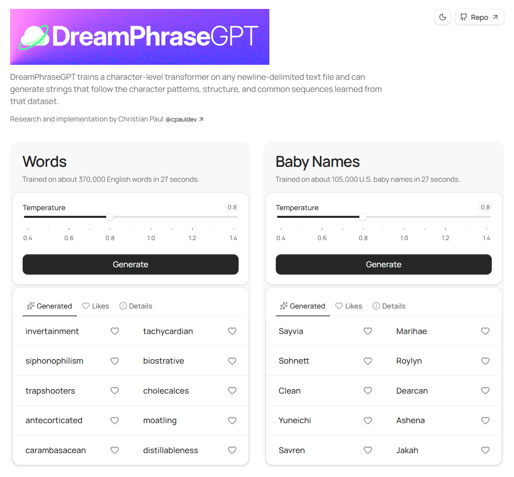

# DreamPhraseGPT

`DreamPhraseGPT` trains a character-level transformer on any newline-delimited text file and can generate strings that follow the character patterns, structure, and common sequences learned from that dataset.

[Live demo](https://cpauldev.github.io/dreamphrase-gpt/)

<details>
<summary>Preview</summary>



</details>

Example outputs trained on English words include `glossoscope`, `heartways`, `bulletine`, `joulemaker`, `braqueousness`, `chlorosiphon`, `langeling`, `margariums`, `outtravelers`, and `zamoralize`.

Example outputs trained on U.S. baby names include `Miryella`, `Beliana`, `Camiliah`, `Cheraine`, `Leeandro`, `Eivyn`, `Franceline`, `Jadiza`, `Dejanell`, and `Zalinda`.

*It supports saved and resumable runs, CPU, CUDA, Apple Silicon / MPS, and a bundled JavaScript runtime.*

## Table of contents

- [Use cases](#use-cases)
- [Requirements](#requirements)
- [Setup](#setup)
- [Quick start](#quick-start)
- [Website](#website)
- [Saved runs](#saved-runs)
- [Datasets](#datasets)
- [Artifact manager](#artifact-manager)
- [Common commands](#common-commands)
- [Architecture and training](#architecture-and-training)
- [Research notes](#research-notes)

## Use cases

`DreamPhraseGPT` is suited to tasks where short generated text should match the character patterns of a source distribution.

### Research application

`DreamPhraseGPT` can generate and score controlled inputs for language-model evaluation and interpretability. Trained on focused data such as English words or short structured strings, it can produce realistic made-up words or short spans in the same style *without pointing to a specific real entity.* This helps separate responses driven by spelling and pattern familiarity from responses driven by prior exposure to a real word or entity.

This is relevant to feature- and circuit-analysis workflows such as:

- Entity recognition and unfamiliar-entity handling
- Hallucination studies
- Refusal and harmful-request recognition
- Jailbreak mechanism analysis
- Chain-of-thought faithfulness checks
- Hidden-goal or persona-conditioned behavior probes

Example workflow:

1. Train `DreamPhraseGPT` on a focused distribution such as English words or short text spans.
1. Generate or score synthetic words — a generated word like `branith` may fit the distribution better than `xqzptl`.
1. Place those strings into prompt templates with matched controls such as real terms, generated terms, obvious gibberish, or minimal edits.
1. Run the target language model on those prompts.
1. Use interpretability tools such as sparse autoencoders (SAEs) or attribution graphs to compare which features or circuits activate.

Related interpretability research from Anthropic includes:

- [Tracing the thoughts of a large language model](https://www.anthropic.com/research/tracing-thoughts-language-model)
- [Scaling Monosemanticity: Extracting Interpretable Features from Claude 3 Sonnet](https://transformer-circuits.pub/2024/scaling-monosemanticity/index.html)
- [On the Biology of a Large Language Model](https://transformer-circuits.pub/2025/attribution-graphs/biology.html)

It can also score or filter candidates by how well they fit the training distribution.

### General application

- Procedural content such as place names, species names, fictional languages, or other structured short-form text
- Baby names based on regional, cultural, or stylistic name lists
- Brand and product names derived from an existing naming style
- Username generation for a specific character pattern or tone
- Medical or scientific terms generated from domain-specific vocabulary

## Requirements

- Python 3.10+
- PyTorch
- Optional: CUDA for `--device cuda`
- Optional: Apple Silicon / MPS for `--device mps`
- Optional: `triton` support if you want CUDA compile mode

## Setup

Create and activate a virtual environment:

```powershell
python -m venv .venv
.venv\Scripts\Activate.ps1
```

Install PyTorch:

```powershell
python -m pip install -U pip
python -m pip install torch
```

If you plan to train on CUDA, install the CUDA-enabled wheel recommended by the [PyTorch install selector](https://pytorch.org/get-started/locally/).

If you want to run the JS bundle:

```powershell
npm install
```

## Quick start

Start with the main menu:

```powershell
python -m dreamphrasegpt
```

Main menu options:

- `train` prompts for dataset and training settings
- `models` opens the saved run manager
- `benchmark` compares CPU with the detected accelerator

Other common entry points:

| Goal                               | Command                                                                                                  |
| ---------------------------------- | -------------------------------------------------------------------------------------------------------- |
| Train with the included dataset    | `python -m dreamphrasegpt --dataset us_baby_names.txt`                                                   |
| Train with Attention Residuals     | `python -m dreamphrasegpt --dataset us_baby_names.txt --residual-mode attnres`                           |
| Train with Block AttnRes           | `python -m dreamphrasegpt --dataset us_baby_names.txt --residual-mode attnres_block --residual-blocks 8` |
| Open the artifact manager directly | `python -m dreamphrasegpt --models`                                                                      |
| Run a benchmark                    | `python -m dreamphrasegpt --compare`                                                                     |
| Run the newest saved JS bundle     | `node scripts/run_js_bundle.js`                                                                          |

Included example outputs:

- `results/non_us_baby_names.txt`, 1000 deduplicated, sorted generated names with exact source matches removed
- `results/nonenglish_words.txt`, 1000 deduplicated, sorted generated words with exact source matches removed

## Website

The browser app lives in `site/`.

Run it locally:

```powershell
cd site
npm install
npm run dev
```

## Saved runs

A standard saved run looks like:

```text
models\
  us_baby_names\
    us_baby_names.model.pt
    us_baby_names.resume.pt
    us_baby_names.model
```

It contains three files:

| File         | Purpose                                                                                                                               | Needed later              |
| ------------ | ------------------------------------------------------------------------------------------------------------------------------------- | ------------------------- |
| `.model.pt`  | Primary PyTorch artifact with model weights and tokenizer. This is the file the manager lists and the file used for Python inference. | Yes, for Python inference |
| `.resume.pt` | Resume companion data with dataset snapshot, optimizer state, scaler state, resume state, and RNG state.                              | Only for exact resume     |
| `.model`     | JavaScript bundle for `scripts/run_js_bundle.js`.                                                                                     | Only for JS inference     |

By default:

- Training and resume save automatically.
- A run based on `mydata.txt` is saved to `models/mydata/`.
- If that folder already exists, the next run becomes `models/mydata_2/`, then `_3`, and so on.
- Use `--output my_run` to save to `models/my_run/`.
- Use `--output PATH` for a custom relative or absolute save path.
- Use `--no-save` to skip writing artifacts.

JavaScript bundle notes:

- Bundles with embedded source-filter metadata reject exact source-line matches automatically.
- If more than one saved run contains the same bundle file name, pass a relative or full path such as `models\us_baby_names_2\us_baby_names.model`.

Examples:

```powershell
node scripts/run_js_bundle.js us_baby_names.model --samples 40 --temperature 0.7
node scripts/run_js_bundle.js models\us_baby_names_2\us_baby_names.model
```

## Datasets

The repository includes:

- `datasets/us_baby_names.txt`, a newline-delimited list of U.S. baby names
- `datasets/english_words.txt`, a newline-delimited list of English words

Dataset sources:

- `us_baby_names.txt` was flattened and deduplicated from U.S. Social Security Administration baby-name data. See [Popular Baby Names | SSA](https://www.ssa.gov/oact/babynames/index.html) and [Popular Baby Names data notes | SSA](https://www.ssa.gov/oact/babynames/births.html).
- `english_words.txt` was sourced from [`words_alpha.txt` in `dwyl/english-words`](https://github.com/dwyl/english-words/blob/master/words_alpha.txt).

To use your own dataset:

- Place a `.txt` file in `datasets/`
- Use one sample per line
- Pass `--dataset PATH` to choose a specific file
- Bare file names such as `--dataset us_baby_names.txt` resolve inside `datasets/`

## Artifact manager

Open it with:

```powershell
python -m dreamphrasegpt --models
```

The manager lists saved runs in `models/` by modification time. Standard run folders are shown by run name; other layouts use a relative path.

Available actions:

- `Load` runs inference from the selected `.model.pt`
- `Resume` continues training when the matching `.resume.pt` file exists
- `Inspect` prints artifact details
- `Delete` removes the selected model artifact and its companion files

If the `.resume.pt` file is removed, the run can still be loaded but can no longer be resumed.

## Common commands

```powershell
python -m dreamphrasegpt --steps 1000
python -m dreamphrasegpt --dataset mydata.txt --steps 5000 --device cuda --output myrun
python -m dreamphrasegpt --dataset mydata.txt --residual-mode attnres
python -m dreamphrasegpt --dataset mydata.txt --residual-mode attnres_block --residual-blocks 8
python -m dreamphrasegpt --dataset mydata.txt --no-save
python -m dreamphrasegpt --models
python -m dreamphrasegpt --compare --compare-steps 500
python scripts/benchmark_residual_modes.py --device cuda --steps 10000 --checkpoint-every 1000
```

For the full CLI, run:

```powershell
python -m dreamphrasegpt --help
```

## Architecture and training

The model is a decoder-only, character-level GPT. It uses:

- Causal self-attention in the style of [Attention Is All You Need](https://arxiv.org/abs/1706.03762), implemented with [`torch.nn.functional.scaled_dot_product_attention`](https://pytorch.org/docs/stable/generated/torch.nn.functional.scaled_dot_product_attention.html)
- Standard residual connections by default, with an experimental `--residual-mode attnres` option that implements the paper's Full AttnRes variant by replacing fixed residual accumulation with learned Attention Residuals over depth
- An experimental `--residual-mode attnres_block` option that follows the paper's Block AttnRes variant, using approximately `--residual-blocks` block summaries across the model's residual sites
- [RMSNorm](https://arxiv.org/abs/1910.07467)
- [SwiGLU](https://arxiv.org/abs/2002.05202) feed-forward layers
- [AdamW](https://pytorch.org/docs/stable/generated/torch.optim.AdamW.html)
- Linear learning-rate decay over the configured training steps
- Optional CUDA AMP for mixed-precision training
- Optional [`torch.compile`](https://pytorch.org/docs/stable/generated/torch.compile.html) on CUDA when Triton and the runtime support it
- Built-in artifact-embedded Bloom filter that rejects exact source-line matches at generation time
- Bundled ONNX export for Node.js inference through [`onnxruntime-node`](https://www.npmjs.com/package/onnxruntime-node)

For small newline-delimited datasets, shorter training runs usually preserve novelty better. The embedded Bloom filter blocks exact source matches, though false positives can occasionally reject a novel output.

## Research notes

Attention Residuals research for this repository is documented in [docs/research/attention-residuals.md](docs/research/attention-residuals.md).

In brief:

- The benchmark reports the paper's claim shape directly: quality at matched step budgets, quality at matched wall-clock budgets, and budget required to reach target losses.
- On the default 4-layer `us_baby_names` setup, `attnres` reaches some `standard` losses in fewer steps, but not in less wall-clock time on this implementation.
- On the default 4-layer `english_words` setup and a deeper 8-layer block-compression run, `standard` remains stronger on both final loss and quality-per-time.
- `attnres_block` is only meaningfully distinct from Full AttnRes once the model has more residual sites than requested block summaries.
- `standard` remains the default configuration for this repository.
